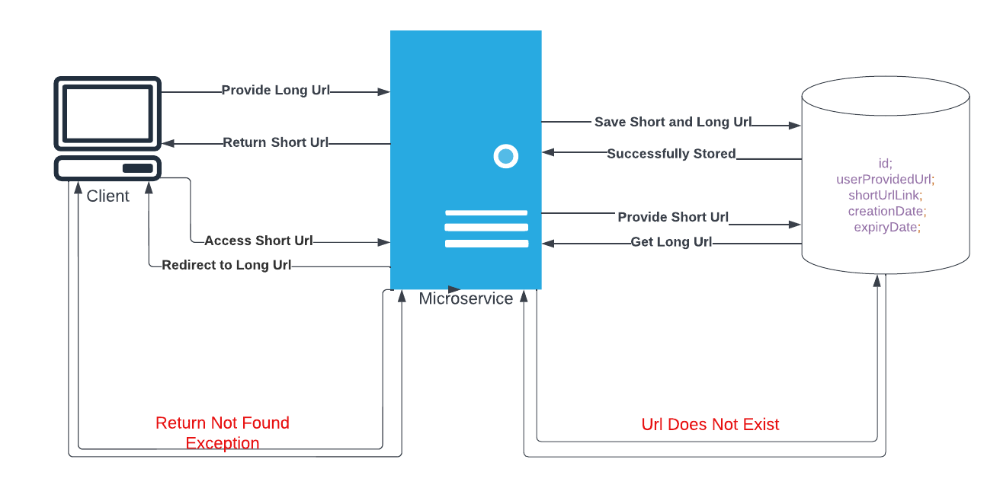

# URL Shortener application

This microservice creates a short url against a long url. Moreover, when user provides the created short url, he/she gets 
redirected to original url. 

## Table of Contents

- [Introduction](#introduction)
  - [Scope](#Scope)
  - [Exposed API](#exposed-api)
- [Overview](#overview)
- [How to Run Program](#How to Run Program)
  - [Maven](#Maven)
  - [Docker Image](#Docker Image)
  - [Jar Execution](#Jar Execution)
## Introduction

- Introduced in Moonshot Demo Release 1.0.4-SNAPSHOT
- Base URI: /url-link
- Git Repo: <https://github.com/rohanraz91/moonshot-url-shortner-application.git>

### Scope
- Accepts a URL input via a web-based user interface
- Generates a shortened URL of the supplied input, stores it, and returns it to the user
- Provides a service that when the shortened URL is supplied, redirects the requestor to the original URL

### Exposed API
- Provide Long URL (via HTTP POST to `/url-link`)
- Get Short URL(via HTTP GET to `/url-link`)
- Redirect to Original URL (via HTTP GET to `/{shortenedLink}`)

## Overview


## How to Run Program
After following below steps, you can access the application by going on to http://localhost:8080/url-link

### Maven
Run the below mvn cmd to start the application
```
mvn spring-boot:run
```

### Docker Image
Note: You need to have docker installed in your machine.

Use the below command to pull the image on to your machine:
```
docker pull rohanraz91/moonshot-urlshortner:1.0.4
```
Then run the downloaded image to start the application using below command:
```
docker run -d -p 8080:8080 rohanraz91/moonshot-urlshortner:1.0.4
```
Please run below command to check if the container is up and running:
```
docker ps
```

### Jar Execution
Please run the below command first:
```
mvn clean install
```
This will create the jar for the application, then execute below command to start the application:
```
java -jar target/urlShorteningService-1.0.X-SNAPSHOT.jar
```
